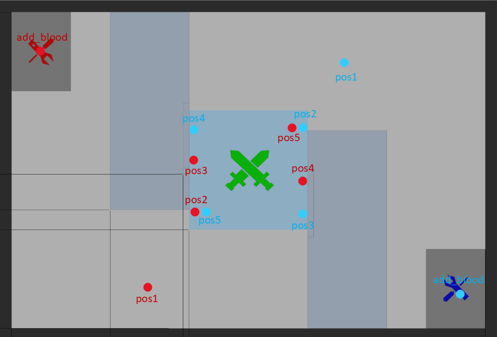

# try_rmul

## 代码中的几个位置如图中所示



## 这里只通过终端输出模拟前往目标点及其他动作，各种状态直接通过指令修改

```bash
# 启动决策树
ros2 launch ul_decision bringup.launch.py
# 比赛开始/结束
ros2 topic pub /game_start std_msgs/msg/Bool "data: true" -1
# 修改当前血量
ros2 topic pub /cur_hp std_msgs/msg/Float32 "data: 400.0" -1
# 控制区状态 1：敌方控制 2：我方控制 3：无人控制
ros2 topic pub /ctlarea_status std_msgs/msg/Int16 "data: 1" -1
# 是否发现敌人
ros2 topic pub /enermy_observed std_msgs/msg/Bool "data: true" -1
# 对方能否上高地
ros2 topic pub /enermy_onhighland std_msgs/msg/Bool "data: true" -1
```